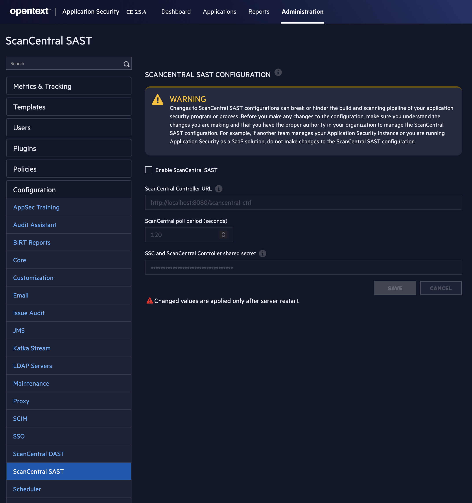
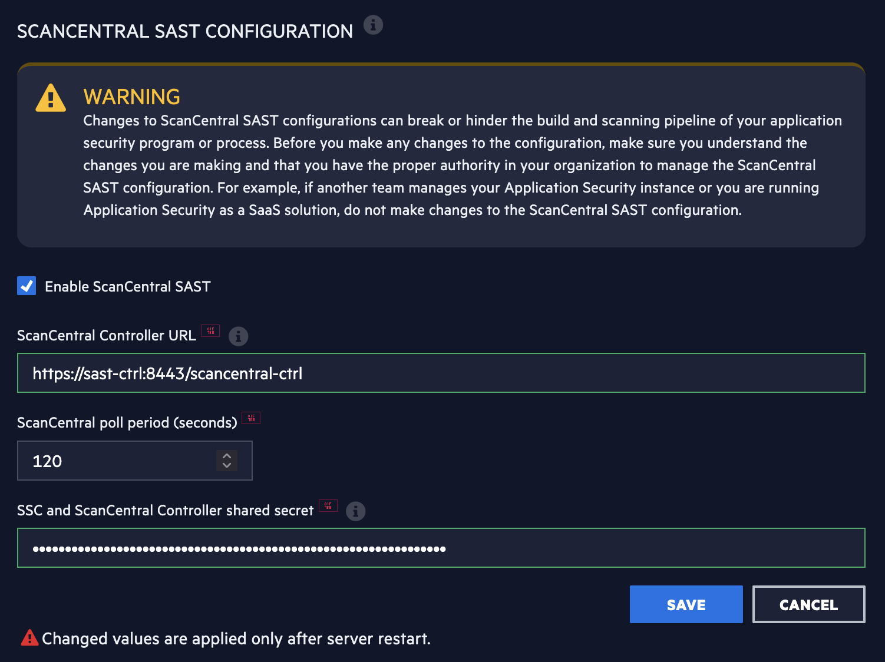

# Fortify ScanCentral SAST – Docker Setup

Docker Compose Setup für **Fortify ScanCentral SAST 25.4** (Controller + Worker).

> **Hinweis:** Dieses Setup ist für Evaluierungs- und PoC-Zwecke gedacht, nicht für den Produktionsbetrieb.

## Voraussetzungen

| Voraussetzung | Details |
|---|---|
| **Docker Desktop** | Version 24.0+ |
| **JDK** | 17+ (für `keytool` zur Zertifikat-Generierung) |
| **Fortify-Lizenz** | Gültige Fortify 25.x Lizenzdatei |
| **Docker Hub Zugang** | Zugriff auf die privaten `fortifydocker` Repositories |
| **Fortify SSC** | Laufende SSC-Instanz (z.B. über [fortify-ssc-docker-setup](https://github.com/janwienand/fortify-ssc-docker-setup)) |

### Systemanforderungen

| | Minimum | Empfohlen |
|---|---|---|
| **RAM** | 8 GB | 16 GB |
| **CPU** | 4 Kerne | 8 Kerne |
| **Festplatte** | 10 GB | 20 GB |

## Quick Start

### 1. Container installieren und starten

```bash
# Repository klonen
git clone https://github.com/janwienand/fortify-scancentral-sast-docker-setup.git
cd fortify-scancentral-sast-docker-setup

# Fortify-Lizenz ablegen
cp /pfad/zu/fortify.license volumes/secrets/fortify.license

# Bei Docker Hub einloggen (Zugriff auf fortifydocker erforderlich)
docker login

# Setup-Skript ausführen
./setup.sh
```

Das Setup-Skript führt automatisch durch alle Schritte: Konfiguration erstellen, Auth-Token generieren, HTTPS-Zertifikate erstellen, Images pullen und Container starten.

### 2. SSC Truststore konfigurieren

Das Setup-Skript konfiguriert den SSL-Trust automatisch (bidirektional: SSC vertraut dem Controller und umgekehrt). Danach muss nur noch die SSC `docker-compose.yml` um folgende Umgebungsvariablen ergänzt werden:

```yaml
environment:
  JVM_TRUSTSTORE_FILE: /app/secrets/truststore.jks
  JVM_TRUSTSTORE_PASSWORD_FILE: /app/secrets/truststore_password
```

SSC mit der neuen Konfiguration neu starten:

```bash
cd ../fortify-ssc-docker-setup
docker compose up -d
```

### 3. ScanCentral SAST in SSC aktivieren

Öffne SSC im Browser unter **https://localhost:8443** und navigiere zu **Administration → Configuration → ScanCentral SAST**:



Aktiviere **Enable ScanCentral SAST** und trage folgende Werte ein:

| Feld | Wert |
|---|---|
| **ScanCentral Controller URL** | `https://sast-ctrl:8443/scancentral-ctrl` |
| **SSC and ScanCentral Controller shared secret** | Inhalt von `volumes/secrets/scancentral-ssc-scancentral-ctrl-secret` |



Die Token-Werte kannst du mit folgendem Befehl auslesen:

```bash
cat volumes/secrets/scancentral-ssc-scancentral-ctrl-secret
```

Klicke auf **Save**.

### 4. SSC neu starten (wichtig!)

Die Änderungen werden erst nach einem Neustart des SSC-Servers wirksam:

```bash
cd ../fortify-ssc-docker-setup
docker compose restart ssc-webapp
```

### 5. Verifizieren

Nach dem Restart erscheint der **ScanCentral**-Tab in der oberen Navigation von SSC:


Unter **ScanCentral → SAST → Sensors** sollte der Worker als **Active** angezeigt werden. Unter **ScanCentral → SAST → Controller** sollte der Status **Available / Active** sein.

## Setup testen mit IWA-Java

Um das Setup zu testen, verwenden wir die [IWA-Java](https://github.com/fortify/IWA-Java) Demo-Anwendung (eine absichtlich verwundbare Java/Spring-Applikation) und die [Fortify CLI (fcli)](https://github.com/fortify/fcli).

### Voraussetzungen

- **Maven** installiert (für den Build der Demo-App)
- **fcli** (Fortify CLI) installiert – siehe nächster Abschnitt

### 1. fcli und ScanCentral Client installieren

**fcli installieren (macOS mit Homebrew):**

```bash
brew install fortify/tap/fcli
```

**fcli installieren (Linux/macOS manuell):**

```bash
# Aktuelle Version herunterladen (Beispiel für macOS ARM)
curl -sL https://github.com/fortify/fcli/releases/latest/download/fcli-mac_arm64.tar.gz | tar xz
sudo mv fcli /usr/local/bin/

# Alternativ für Linux x64:
# curl -sL https://github.com/fortify/fcli/releases/latest/download/fcli-linux_x64.tar.gz | tar xz
```

**fcli installieren (Windows):**

```powershell
# Installer herunterladen und ausführen
Invoke-WebRequest -Uri https://github.com/fortify/fcli/releases/latest/download/fcli-windows_x64.zip -OutFile fcli.zip
Expand-Archive fcli.zip -DestinationPath C:\fcli
# C:\fcli zum PATH hinzufügen
```

Alle Downloads: https://github.com/fortify/fcli/releases

**ScanCentral Client über fcli installieren:**

```bash
fcli tool sc-client install -v latest -y
```

### 2. IWA-Java klonen und bauen

```bash
git clone https://github.com/fortify/IWA-Java.git
cd IWA-Java
mvn clean package -DskipTests
```

### 3. Bei SSC anmelden

```bash
CLIENT_TOKEN=$(cat volumes/secrets/scancentral-client-auth-token)

fcli ssc session login \
    --url https://localhost:8443 \
    -u admin -p <SSC_PASSWORD> \
    -k \
    --sc-sast-url https://localhost:9443/scancentral-ctrl \
    -c "$CLIENT_TOKEN"
```

- `-k` deaktiviert die SSL-Zertifikatsprüfung (notwendig bei selbstsignierten Zertifikaten)
- `--sc-sast-url` überschreibt die interne Docker-URL mit der extern erreichbaren URL
- `-c` übergibt das ScanCentral Client Auth-Token

### 4. Application Version in SSC erstellen

```bash
fcli ssc appversion create \
    IWA-Java:1.0 \
    --auto-required-attrs \
    --skip-if-exists \
    --issue-template "Prioritized High Risk Issue Template"
```

### 5. Source Code paketieren

```bash
scancentral package -bt mvn -o IWA-Java-package.zip
```

Dieser Befehl erstellt ein optimiertes ZIP-Paket mit dem relevanten Source Code und den Abhängigkeiten.

### 6. Scan starten

```bash
fcli sc-sast scan start \
    --publish-to IWA-Java:1.0 \
    -f IWA-Java-package.zip \
    --store myScan
```

### 7. Auf Scan-Ergebnis warten

```bash
fcli sc-sast scan wait-for ::myScan:: --timeout 1h --interval 30s
```

### 8. Erstes Artefakt genehmigen

Beim ersten Upload muss das Scan-Artefakt in SSC genehmigt werden. Das ist ein einmaliger Schritt pro Application Version und dient als Sicherheitsmaßnahme:

```bash
# Artefakt-ID ermitteln
fcli ssc artifact list --av IWA-Java:1.0

# Artefakt genehmigen (ID aus dem vorherigen Befehl)
fcli ssc artifact approve <ARTIFACT_ID>
```

Nach dem Approve wird das Artefakt verarbeitet und die Findings erscheinen in SSC.

### 9. Ergebnisse prüfen

```bash
# Anzahl der Findings anzeigen
fcli ssc issue count --av IWA-Java:1.0

# Findings auflisten
fcli ssc issue list --av IWA-Java:1.0
```

Die Ergebnisse sind auch im SSC Web-Interface unter **Applications → IWA-Java → 1.0** sichtbar.

### 10. Aufräumen (optional)

```bash
fcli ssc session logout
```

## Manuelle Installation (Schritt für Schritt)

Falls du das Setup-Skript nicht verwenden möchtest, kannst du die Schritte auch manuell durchführen.

### 1. Repository klonen

```bash
git clone https://github.com/janwienand/fortify-scancentral-sast-docker-setup.git
cd fortify-scancentral-sast-docker-setup
```

### 2. Konfiguration erstellen

```bash
cp .env.example .env
```

Falls deine SSC-Instanz nicht auf dem gleichen Docker-Netzwerk läuft, passe `SCANCENTRAL_CONFIG_SSC_URL` in der `.env` an.

**Wichtig:** Der `DOCKER_NETWORK_NAME` muss mit dem Netzwerk übereinstimmen, in dem SSC läuft. Prüfe das mit:

```bash
docker network ls | grep fortify
```

### 3. Fortify-Lizenz ablegen

```bash
cp /pfad/zu/fortify.license volumes/secrets/fortify.license
```

### 4. Auth-Token generieren

Das gleiche Token wird für Worker, Client und SSC-Secret verwendet:

```bash
AUTH_TOKEN=$(openssl rand -hex 32)
echo -n "$AUTH_TOKEN" > volumes/secrets/scancentral-worker-auth-token
echo -n "$AUTH_TOKEN" > volumes/secrets/scancentral-client-auth-token
echo -n "$AUTH_TOKEN" > volumes/secrets/scancentral-ssc-scancentral-ctrl-secret
```

### 5. HTTPS-Zertifikat erstellen

```bash
# Zufälliges Passwort generieren
KEYSTORE_PASSWORD=$(openssl rand -base64 24)
echo -n "$KEYSTORE_PASSWORD" > volumes/secrets/keystore_password

# JKS Keystore für den Controller
keytool -genkeypair \
    -alias scancentral \
    -keyalg RSA -keysize 2048 -validity 365 \
    -storetype JKS \
    -keystore volumes/secrets/httpKeystore.jks \
    -storepass "$KEYSTORE_PASSWORD" -keypass "$KEYSTORE_PASSWORD" \
    -dname "CN=sast-ctrl, OU=Fortify, O=OpenText" \
    -ext "SAN=DNS:sast-ctrl,DNS:localhost,IP:127.0.0.1"

# Zertifikat exportieren und Truststore für den Worker erstellen
keytool -exportcert \
    -alias scancentral \
    -keystore volumes/secrets/httpKeystore.jks \
    -storepass "$KEYSTORE_PASSWORD" \
    -file /tmp/scancentral-cert.pem -rfc

TRUSTSTORE_PASSWORD=$(openssl rand -base64 24)
echo -n "$TRUSTSTORE_PASSWORD" > volumes/secrets/truststore_password

keytool -importcert \
    -alias scancentral \
    -file /tmp/scancentral-cert.pem \
    -keystore volumes/secrets/truststore.jks \
    -storepass "$TRUSTSTORE_PASSWORD" -noprompt

rm /tmp/scancentral-cert.pem
```

### 6. Verzeichnisse und Berechtigungen

```bash
mkdir -p volumes/data

# Nur auf Linux: Berechtigungen für Container-User setzen
sudo chown -R 1111:1111 volumes/data volumes/secrets
sudo chmod -R 770 volumes/data volumes/secrets
```

### 7. Docker-Netzwerk und Container starten

```bash
# Netzwerk erstellen (falls es nicht bereits von SSC erstellt wurde)
docker network create fortify

# Bei Docker Hub einloggen
docker login

# Container starten
docker compose up -d
```

Danach mit den Schritten **2–5 aus dem Quick Start** fortfahren (SSC Truststore, ScanCentral SAST aktivieren, SSC neu starten, verifizieren).

## Architektur

```
┌─────────────────────────────────────────────────────┐
│                  Docker Network: fortify             │
│                                                      │
│  ┌──────────┐    ┌──────────────┐    ┌────────────┐ │
│  │   SSC    │◄───│  Controller  │◄───│   Worker   │ │
│  │  :8443   │    │    :9443     │    │            │ │
│  └──────────┘    └──────────────┘    └────────────┘ │
│                         ▲                            │
│                    ┌────┴─────┐                      │
│                    │ DB-Migr. │                      │
│                    │ (einmal) │                      │
│                    └──────────┘                      │
└─────────────────────────────────────────────────────┘
```

- **Controller** – Verwaltet Scan-Jobs und verteilt sie an Worker
- **Worker (Sensor)** – Führt die eigentlichen SAST-Scans durch
- **DB-Migration** – Initialisiert die eingebettete H2-Datenbank (läuft nur beim ersten Start)

## Nützliche Befehle

```bash
# Logs anzeigen
docker compose logs -f

# Nur Controller-Logs
docker compose logs -f sast-ctrl

# Nur Worker-Logs
docker compose logs -f sast-worker

# Container stoppen
docker compose down

# Container neu starten
docker compose down && docker compose up -d

# In den Controller-Container verbinden
docker compose exec sast-ctrl bash

# Status prüfen
docker compose ps
```

## Dateistruktur

```
fortify-scancentral-sast-docker-setup/
├── .env.example                      # Konfigurationsvorlage
├── .gitignore
├── docker-compose.yml                # Container-Definition
├── README.md
├── setup.sh                          # Automatisches Setup-Skript
├── docs/
│   └── images/                       # Screenshots für die Anleitung
└── volumes/
    ├── data/                         # Persistente Daten (wird erstellt)
    └── secrets/
        ├── fortify.license                          # ← Hier ablegen
        ├── scancentral-worker-auth-token            # Worker Auth-Token (generiert)
        ├── scancentral-client-auth-token            # Client Auth-Token (generiert)
        ├── scancentral-ssc-scancentral-ctrl-secret  # SSC Shared Secret (generiert)
        ├── httpKeystore.jks                         # HTTPS-Keystore (generiert)
        ├── truststore.jks                           # Truststore für Worker (generiert)
        ├── keystore_password                        # Keystore-Passwort (generiert)
        └── truststore_password                      # Truststore-Passwort (generiert)
```

## Fehlerbehebung

| Problem | Lösung |
|---|---|
| `image not found` | `docker login` ausführen – dein Account braucht Zugriff auf `fortifydocker` |
| `SCANCENTRAL_CONFIG_SSC_URL is required` | `.env` Datei prüfen – `SCANCENTRAL_CONFIG_SSC_URL` muss gesetzt sein |
| `SCANCENTRAL_URL environment variable is required` | `.env` Datei prüfen – `SCANCENTRAL_URL` muss gesetzt sein |
| `PKIX path building failed` | SSC vertraut dem Controller-Zertifikat nicht – siehe Schritt 2 im Quick Start |
| Controller startet nicht | Prüfe die Logs: `docker compose logs sast-ctrl` |
| Worker verbindet sich nicht | Auth-Token in SSC und in `volumes/secrets/` müssen übereinstimmen |
| Controller/Sensor nicht in SSC sichtbar | SSC nach Konfigurationsänderung neu starten: `docker compose restart ssc-webapp` |
| DB-Migration schlägt fehl | `volumes/data` Verzeichnis löschen und neu starten |
| SSC nicht erreichbar | Stelle sicher, dass SSC im selben Docker-Netzwerk läuft (`docker network ls`) |
| Netzwerk existiert nicht | `docker network create fortify` ausführen |
| Platform-Warnung (linux/amd64) | Normal auf Apple Silicon (M1/M2/M3) – läuft über Rosetta-Emulation |
